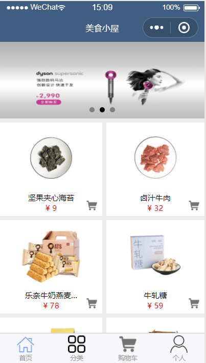
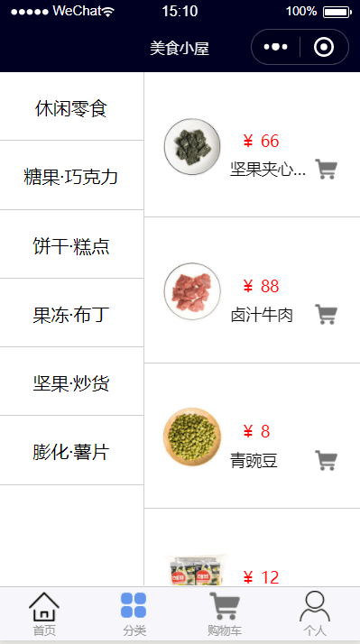
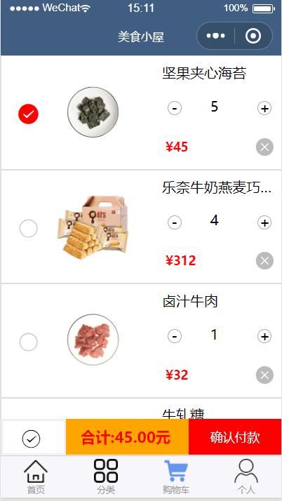
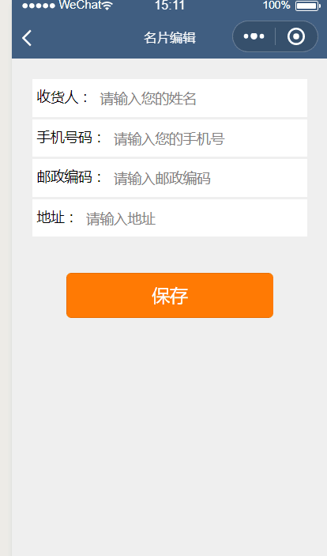

# 微信小程序项目-美食小屋
## [功能描述]：
#### 1. 首页轮播.
#### 2. tab页与普通页互相跳转.
#### 3. 实现数据本地存储.
#### 4. 实现多页面购物车添加.
#### 5. 实现商品分类.
#### 6. 实现购物车结算功能,包括添加,删除,单选,复选,,计算总价
#### 7. 实现个人信息保存.
#### 8. 定位当前地址.
#### 9. 摇一摇功能暂未实现.
## [开发环境]：微信开发者工具V1.02
## [项目结构简介]:
> app  小程序结构
>  

> > iamges           // 项目所需图片
> 
> > pages            // 各个页面
>
>  > > index         //  商城首页
>
>  > > > > index.js     //  页面交互
>
>  > > > > index.json     //  页面配置
>
>  > > > > index.wxml     //  页面详情
>
>  > > > > index.wxss     //  页面样式
>
>  > > > detail     //  商品详情
>
>  > >  classify     //  商品分类
>
>  > > cart          //  购物车
>
>  > > > pay1        // 支付页面
>
>  > > > pay2        // 支付成功
>
>  > > member        // 个人页面
>
>  > > > info        // 手机信息
>
>  > > > credit      //  名片填写
>
>  > > > cardit1     //  名片详情
>
>  > > > address     // 地址
>
>  > > > shake       // 摇一摇
>
> > utils            // 工具包
>
> > app.js           // 项目入口文件
>
> > app.json         // 全局配置
>
> > app.wxss         // 全局样式设置
>
> > project.config.json   // 项目配置文件
>

## [图片预览]： 

## [作者列表]：
###### icket_15 宋晓勇 icket_15 管志颖 icket_15 郭懿 icket_15 杨洋
